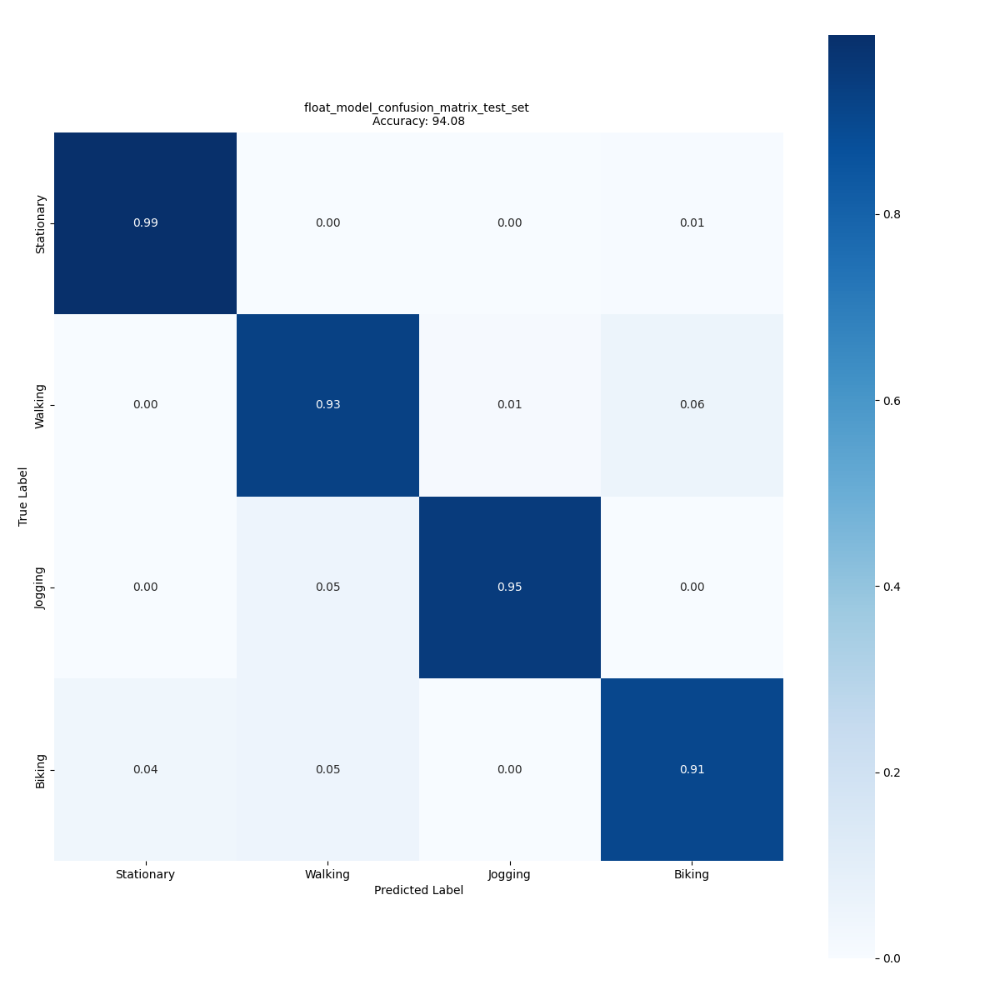

# GMP HAR model

## **Use case** : [Human activity recognition](../../../human_activity_recognition/)

# Model description

GMP is an acronym for Global Max Pooling. It is a convolutional neural network (CNN) based model that uses Global Max Pooling before feeding the data to the fully-connected (Dense) layer for performing the human activity recognition (HAR) task based on the accelerometer data. It uses the 3D raw data with gravity rotation and supression filter as preprocessing. This is a very light model with very small foot prints in terms of FLASH and RAM as well as computational requirements.

This network supports any input size greater than (3 x 3 x 1) but we recommend to use at least (24 x 3 x 1), i.e. a window length of 24 samples. In this folder we provide GMP models trained with two different window lenghts [24 and 48].

The only input required to the model is the input shape and the number of output classes.

In this folder you will find different copies of the GMP model pretrained on a public dataset ([WISDM](https://www.cis.fordham.edu/wisdm/dataset.php)) and a custom dataset collected by ST  (mobility_v1). 

## Network information (for WISDM at wl = 24)

| Network Information     |  Value          |
|:-----------------------:|:---------------:|
|  Framework              | TensorFlow      |
|  Params                 | 1,528           |

## Network inputs / outputs

For a frame of resolution of (wl x 3) and P classes

| Input Shape | Description |
| :----:| :-----------: |
| (1, wl, 3, 1) | Single ( wl x 3 x 1 ) matrix of accelerometer values, `wl` is window lenght, for 3 axes and 1 is channel in FLOAT32.|

| Output Shape | Description |
| :----:| :-----------: |
| (1, P) | Per-class confidence for P classes in FLOAT32|

## Recommended platforms

| Platform | Supported | Recommended |
|:--------:|:---------:|:-----------:|
| STM32L4  |    [x]    |      []     |
| STM32U5  |    [x]    |      [x]    |

# Performances
## Training
../../src/user_config.yaml

To train a gmp model, you need to configure the [user_config.yaml](../../src/user_config.yaml) file following the [tutorial](../../src/training/README.md) under the training section.

To train a GMP model, you need to configure the [user_config.yaml](../../src/user_config.yaml) file following the [tutorial](../../src/README.md) under the training section.

As an example, [gmp_wl_24_config.yaml](../gmp/ST_pretrainedmodel_public_dataset/WISDM/gmp_wl_24/gmp_wl_24_config.yaml) file is used to train this model on WISDM dataset. Users can copy its content in the [user_config.yaml](../../src/user_config.yaml) file provided under the [human_acitivity_recognition/src](../../src/) directory to reproduce the results presented below. 

## Deployment

To deploy your trained model, you need to configure the [user_config.yaml](../../src/user_config.yaml) file following the [tutorial](../../deployment/README.md) in the deployment directory for WISDM dataset.

## Metrics

Measures are done with default STM32Cube.AI Dev Cloud version 9.1.0 and for target board B-U585I-IOT02A. In addition the configuration were enabled input / output allocated option and `balanced` as optimization choice.

The inference time is reported is calculated on STM32 board **B-U585I-IOT02A** running at Frequency of **160 MHz**.

### Reference memory footprint based on WISDM dataset (see Accuracy for details on dataset)

| Model                                                                        | Format | Input Shape | Target Board  | Activation RAM (KiB) | Runtime RAM (KiB) | Weights Flash (KiB) | Code Flash (KiB) | Total RAM (KiB)   | Total Flash (KiB) | Inference Time (ms) | STM32Cube.AI version  |
|:----------------------------------------------------------------------------:|:------:|:-----------:|:-------:|:--------------------:|:-----------------:|:-------------------:|:----------------:|:-----------------:|:-----------------:|:---------------------:|:---------------------:|
| [GMP wl 24](ST_pretrainedmodel_public_dataset/WISDM/gmp_wl_24/gmp_wl_24.h5)  | FLOAT32| 24 x 3 x 1  | B-U585I-IOT02A | 4.25          | 2.08              | 5.70                | 12.29            |  6.33             | 18.96             | 4.42      | 9.1.0     |
| [GMP wl 48](ST_pretrainedmodel_public_dataset/WISDM/gmp_wl_48/gmp_wl_48.h5)  | FLOAT32| 48 x 3 x 1  | B-U585I-IOT02A | 8.83          | 2.08              | 5.70                | 12.29            |  10.91            | 18.96             | 10.64     | 9.1.0     |

### Accuracy with mobility_v1 dataset

Dataset details: A custom dataset and not publically available, Number of classes: 5 [Stationary, Walking, Jogging, Biking, Vehicle]. **(We kept only 4, [Stationary, Walking, Jogging, Biking]) and removed Driving**, Number of input frames:  81,151 (for wl = 24), and 40,575 for (wl = 48).

| Model                                                                                          |  Format  | Resolution | Accuracy (%) |
|:----------------------------------------------------------------------------------------------:|:--------:|:----------:|:-------------:|
| [GMP wl 24](./ST_pretrainedmodel_custom_dataset/mobility_v1/gmp_wl_24/gmp_wl_24.h5)            | FLOAT32  | 24 x 3 x 1 | 94.08         |
| [GMP wl 48](./ST_pretrainedmodel_custom_dataset/mobility_v1/gmp_wl_48/gmp_wl_48.h5)            | FLOAT32  | 48 x 3 x 1 | 93.84         |

Confusion matrix for GMP wl 24 with Float32 weights for mobility_v1 dataset is given below.

### Accuracy with WISDM dataset

Dataset details: [link](([WISDM](https://www.cis.fordham.edu/wisdm/dataset.php))) , License [CC BY 2.0](https://creativecommons.org/licenses/by/2.0/) , Quotation[[1]](#1) , Number of classes: 6 (we are **combining Upstairs and Downstairs into Stairs** and **Standing and Sitting into Stationary**), Number of samples: 45,579 (at wl = 24), and 22,880 (at wl = 48).

| Model                                                                                  |  Format  |  Resolution |  Accuracy (%)  |
|:--------------------------------------------------------------------------------------:|:--------:|:-----------:|:--------------:|
| [GMP wl 24](./ST_pretrainedmodel_public_dataset/WISDM/gmp_wl_24/gmp_wl_24.h5)            | FLOAT32  | 24 x 3 x 1  | 84.49          |
| [GMP wl 48](./ST_pretrainedmodel_public_dataset/WISDM/gmp_wl_48/gmp_wl_48.h5)            | FLOAT32  | 48 x 3 x 1  | 87.05          |

## Training and code generation

- Link to training script: [here](../../src/training/README.md) training section
- Link to STM32Cube.AI generation and deployment script: [here](../../deployment/README.md)

## Demos
### Integration in a simple example

Please refer to the generic guideline [here](../../deployment/README.md).

# References

<a id="1">[1]</a>
“WISDM : Human activity recognition datasets". [Online]. Available: "https://www.cis.fordham.edu/wisdm/dataset.php".
