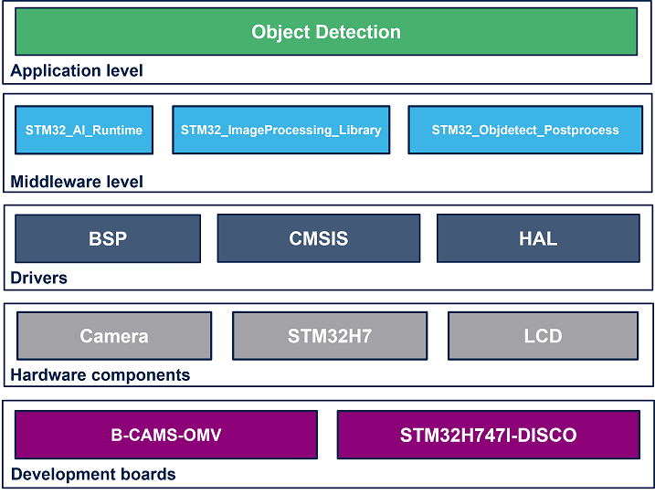
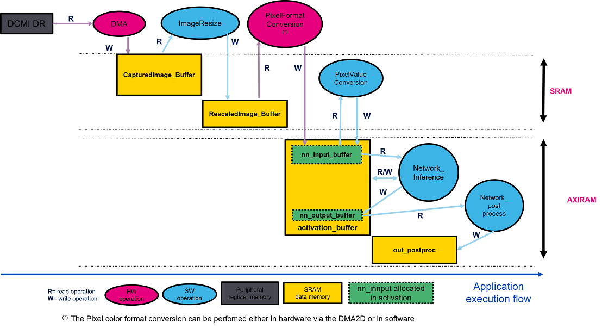

# __Object Detection Getting Started__

The purpose of this package is to enable object detection application on a STM32 board.

This project provides an STM32 microcontroller embedded real time environnement to execute [X-CUBE-AI](https://www.st.com/en/embedded-software/x-cube-ai.html) generated model targeting object detection application.


### __Directory contents__

This repository is structured as follows:

| Directory                                                              | Content                                                   |
|:---------------------------------------------------------------------- |:--------------------------------------------------------- |
| Application\\<STM32_Board_Name>\\STM32CubeIDE                          | cubeIDE project files; only IDE files related             |
| Application\\<STM32_Board_Name>\\Inc                                   | Application include files                                 |
| Application\\<STM32_Board_Name>\\Src                                  | Application source files                                  |
| Application\Network\\*                                                 | *Place holder* for AI C-model; files generated by cubeAI  |
| Drivers\CMSIS                                                          | CMSIS Drivers                                             |
| Drivers\BSP                                                            | Board Support Package and Drivers                         |
| Drivers\STM32XXxx_HAL_Driver                                           | Hardware Abstraction Layer for STM32XXxx family products  |
| Middlewares\ST\STM32_AI_Runtime                                        | *Place holder* for AI runtime library                     |
| Middlewares\ST\STM32_ImageProcessing_Library                           | Usual image processing functions                          |
| Middlewares\Utilities\Fonts                                            | API to manage the fonts                                   |
| Middlewares\Utilities\lcd                                              | API to manage the lcd screen                              |

## __Before You Start__

### __Hardware and Software environment__

In order to run this object detection application examples you need to have the following hardware:

- [STM32H747I-DISCO](https://www.st.com/en/product/stm32h747i-disco) discovery board
- [B-CAMS-OMV](https://www.st.com/en/product/b-cams-omv) camera bundle

Only this hardware is supported for now

### __Tools installations__

This getting started needs [STM32CubeIDE](https://www.st.com/content/st_com/en/products/development-tools/software-development-tools/stm32-software-development-tools/stm32-ides/stm32cubeide.html) as well as [X-CUBE-AI](https://www.st.com/en/embedded-software/x-cube-ai.html) (From `v7.3.0` until latest).


You can find the info to install the tools in the parents [README](../../object_detection/deployment/README.md) of the deployment part and the general [README](../../README.md) of the model zoo. 


## __Deployment__

### __Generate C code from tflite file__

This repo does not provide the AI C-model generated by X-CUBE-AI.

The user needs to generate the AI C-model.

It is directly generated by the [deployment script](../../object_detection/deployment/deploy.py) of the model zoo.

### __Build and deploy__

You should use the [deploy.py](../../object_detection/deployment/deploy.py) script to automatically build and deploy the program on the target (if the hardware is connected).

You can launch the `Application\STM32H747I-DISCO\STM32CubeIDE\.project` with STM32CubeIDE. With the IDE you can modify, build and deploy on the target.

## __Getting started deep dive__

The purpose of this package is to enable object detection application on a STM32 board. 

This package also provides a feature-rich image processing library ([STM32_ImageProcessing_Library](./Middlewares/ST/STM32_ImageProcessing_Library/) software component).


### __Processing workflow__

The software executes an object detection on each image captured by the camera. The framerate depends on the inference time


- Captured_image: Image From the camera

- Network_Preprocess: 3 steps:
   *  ImageResize: rescale to the resolution needed by the network
   *  PixelFormatConversion: Convert Image input (usually RGB565) to needed color channels (RGB888 or Grayscale)
   *  PixelValueConversion: Convert to pixel types used by the network (uint8 or int8)

- HxWxC : Height, Width and Number of color channels: format defined by the given network

- Network_Inference: Call AI C-model network

- Network post process:

   * Call Output_Dequantize to convert the output to the right output type (only float32 for now)

   * In the context of Object detections model there is several filtering algorithms to apply at the output of the model in order to get the proper bounding boxes

   * For now we support ssd type of post processing, YoloV2 postprocessing as well as centernet networks


### __Memory Layout__

The application software uses different buffers. The following diagram describes how there are used and which functions interact with it. 





### __Model configuration__

The `'<getting-start-install-dir>/Application/STM32H747I-DISCO/Inc/CM7/ai_model_config.h'` file contains configuration information.

This file is generated by the deploy.py script.

The number of output class for the model:

```C
#define NB_CLASSES          (2)
```

The dimension of the model input tensor:

```C
#define INPUT_HEIGHT        (192)
#define INPUT_WIDTH         (192)
#define INPUT_CHANNELS      (3)
```

A table containing the list of the labels for the output classes:

```C
#define CLASSES_TABLE const char* classes_table[NB_CLASSES] = {\
   "background", "person" }\
```

Concerning the type of resizing algorithm that is used by the preprocessing stage, only the nearest neighbor algorithm is supported.

Input frame aspect ratio algorithms:
```C
#define ASPECT_RATIO_FIT            0
#define ASPECT_RATIO_CROP         1
#define ASPECT_RATIO_PADDING 2

#define ASPECT_RATIO_MODE ASPECT_RATIO_FIT
```
Post processing type to apply
```C
#define POSTPROCESS_CENTER_NET (0)
#define POSTPROCESS_YOLO_V2    (1)
#define POSTPROCESS_ST_SSD     (2)

#define POSTPROCESS_TYPE POSTPROCESS_ST_SSD
```


The pixel color format that is expected by the neural network model: 

```C
#define RGB_FORMAT        (1)
#define BGR_FORMAT        (2)
#define GRAYSCALE_FORMAT  (3)
#define PP_COLOR_MODE    RGB_FORMAT
```

Data format supported for the input and/or the output of the neural network model: 
```C
#define UINT8_FORMAT     (1)
#define INT8_FORMAT      (2)
#define FLOAT32_FORMAT   (3)
```

Data format that is expected by the input layer of the quantized neural network model (only UINT8 and INT8 formats are supported in V1.0):
```C
#define QUANT_INPUT_TYPE    INT8_FORMAT
```

Data format that is provided by the output layer of the quantized neural network model (only FLOAT32 format is supported in V1.0):
```C
#define QUANT_OUTPUT_TYPE    FLOAT32_FORMAT
```


The rest of the model details will be embedded in the `.c` and `.h` files generated by the tool [X-CUBE-AI](https://www.st.com/en/embedded-software/x-cube-ai.html). 

### __Image preprocessing__

The frame captured by the camera is in a standard video format. As the neural network needs to receive a square-shaped image in input, three solutions are provided to reshape the captured frame before running the inference
- ASPECT_RATIO_FIT: the frame is compacted to fit into a square with a side equal to the height of the captured frame. The aspect ratio is modified. 

- ASPECT_RATIO_CROP: the frame is cropped to fit into a square with a side equal to the height of the captured frame. The aspect ratio remains but some data is lost on each side of the image. 


-ASPECT_RATIO_PADDING: the frame is filled with black borders to fit into a square with a side equal to the width of the captured frame. The aspect ratio remains. 


## __Limitations__

- Supports only networks up to 240x240 input resolutions (SSD 256x256 is not yet supported by this code base)
- Supports from Cube.AI v7.3.0 until latest version
- Supports only the STM32H747I-DISCO board with B-CAMS-OMV camera module.
- Supports only 8-bits quantized model
- Input layer of the quantized model supports only data in UINT8 or INT8 format
- Output layer of the quantized model provides data in only FLOAT32 format
- Limited to STM32CubeIDE / arm gcc toolchain.
- Manageable through STM32CubeIDE (open, modification, debug)
